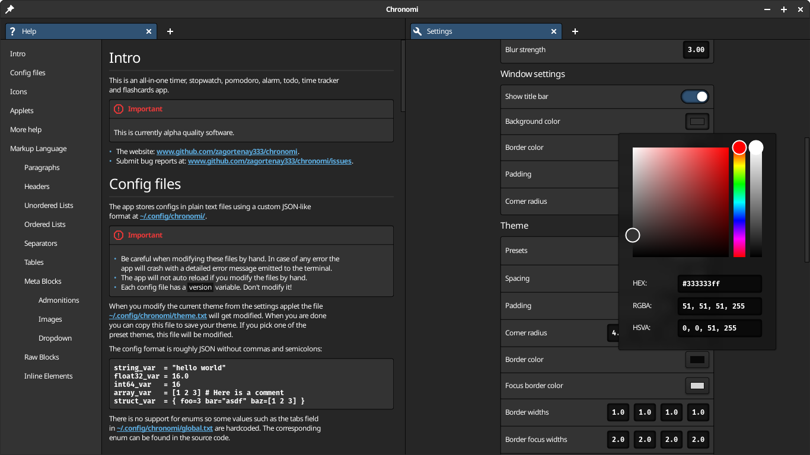

# Chronomi

**All-in-one timer, stopwatch, pomodoro, alarm, todo, and flashcards linux app.**

## Download

1. [Download the appimage file](https://github.com/zagortenay333/chronomi/releases).
2. Mark the downloaded file as executable.
3. Run the program.

## Compile

1. The project is written in `C23`, so you'll need newer versions of gcc/clang.
2. Install the libraries: `sdl3`, `freetype`, and `harfbuzz`.
3. Run `make release/debug/asan`.

## Gnome-shell extension

Check out the gnome-shell extension version of this app at: https://github.com/zagortenay333/cronomix.
